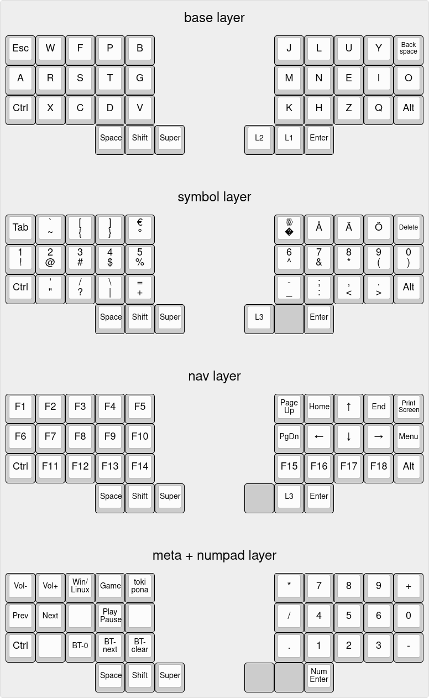

# leko pona 1 zmk config
This repo just has my layout files for leko pona 1. See [this repo](https://git.crispypin.cc/CrispyPin/leko-pona) for more info on the keyboard itself.

The layout visualisation is generated with [keyboard-layout-editor.com](http://www.keyboard-layout-editor.com/) using [layout.txt](layout.txt)

